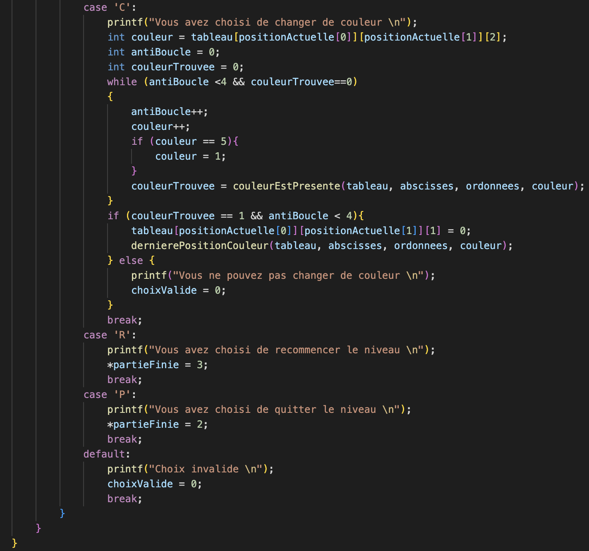

# 🏎 Déroulé d'une partie

## Boucle d'une partie

.png>)

## Action d'un tour

.png>)

.png>)

.png>)

## Le déplacement

.png>)

## Dernière position

## Vérification de présence de couleur

.png>)
